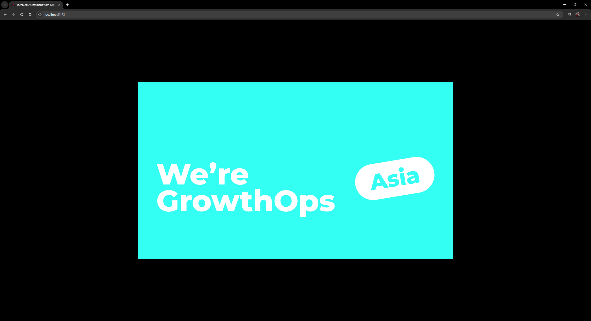
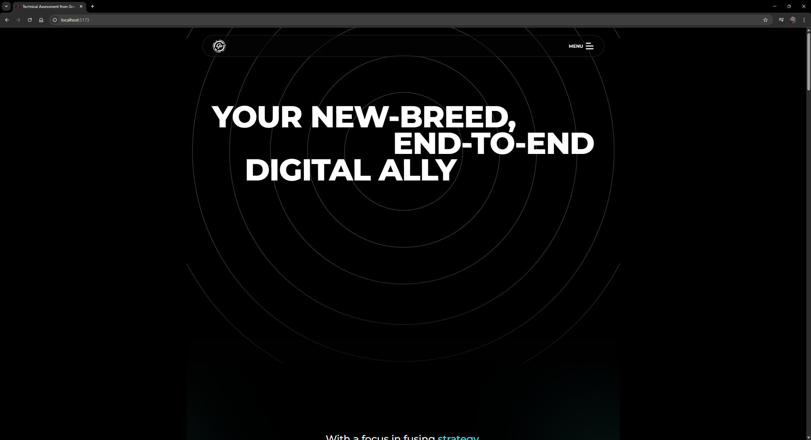
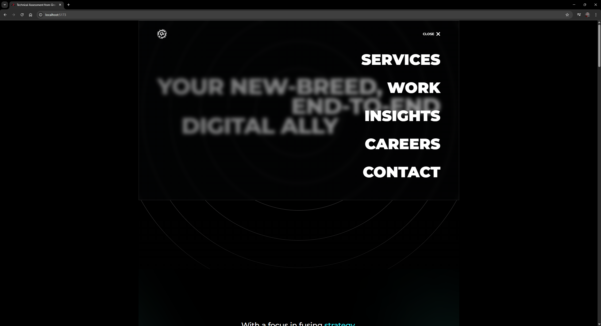
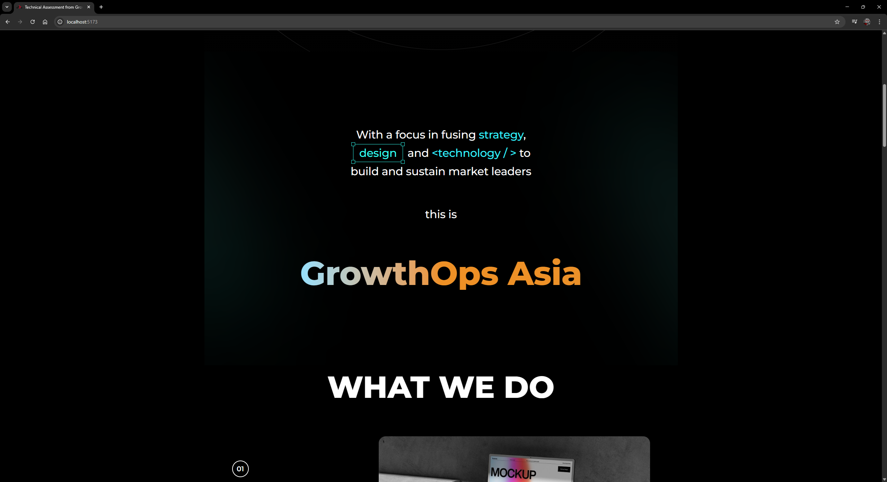
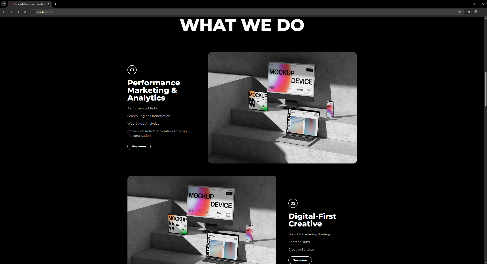
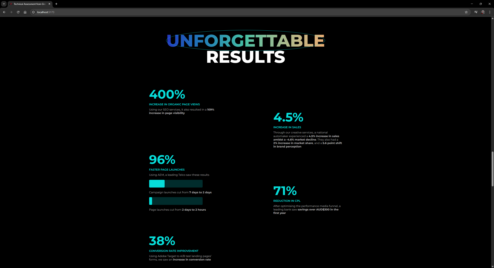
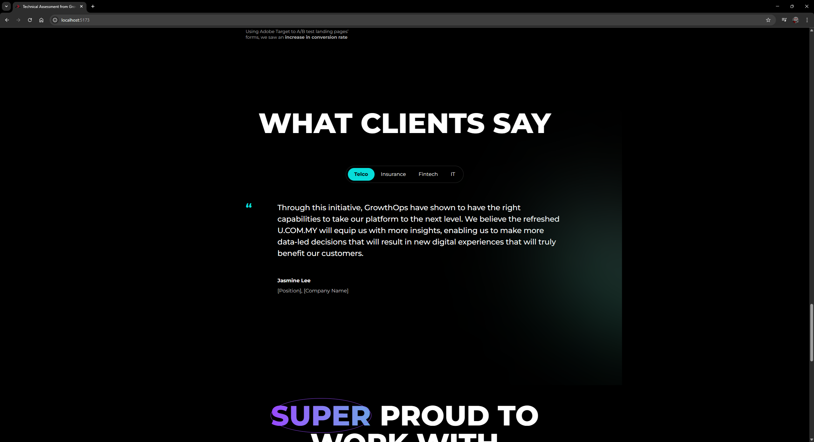
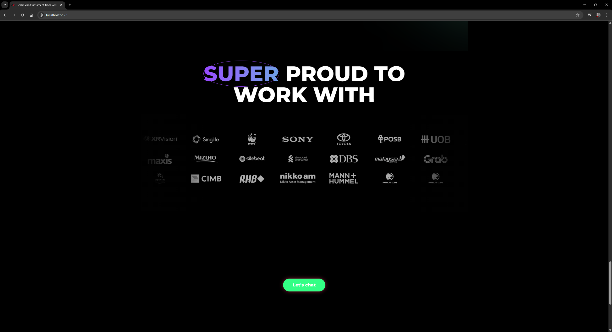
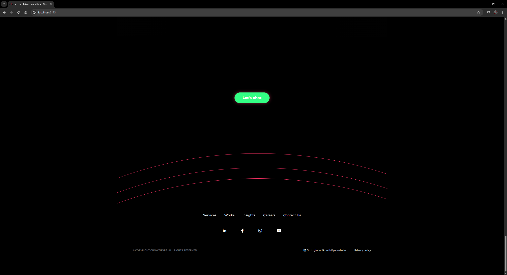
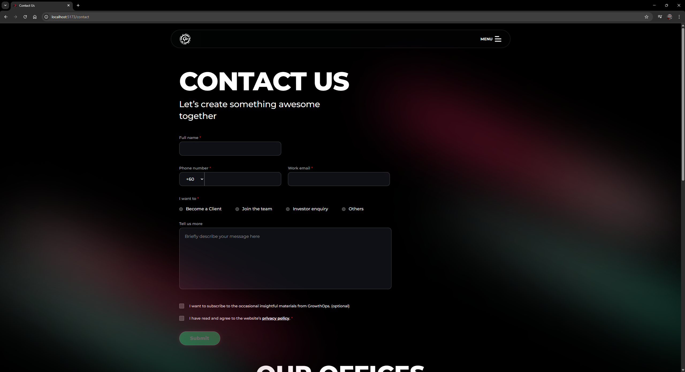

# Welcome to React Router!

This is frontend web developer assessment from GrowthOps developed in React with Tailwind CSS.

## Features

-  [React](https://react.dev/)
-  [React Router Docs](https://reactrouter.com/)
-  [TailwindCSS](https://tailwindcss.com/)

## Getting Started

### Installation

Install the dependencies:

```bash
npm install
```

### Development

Start the development server with HMR:

```bash
npm run dev
```

Your application will be available at `http://localhost:5173`.

## Styling

This template comes with [Tailwind CSS](https://tailwindcss.com/) already configured for a simple default starting experience. You can use whatever CSS framework you prefer.


## Samples Pages
### Introduction view when navigate to the landing page


### Contents









### Contact Us


---
Built with ❤️ using React Router.
